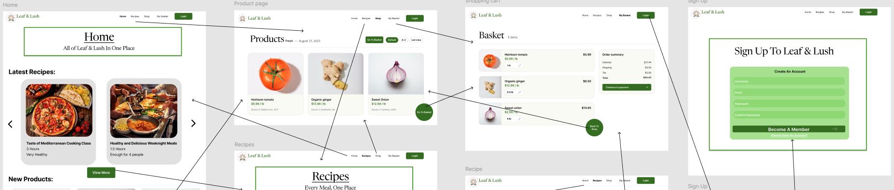
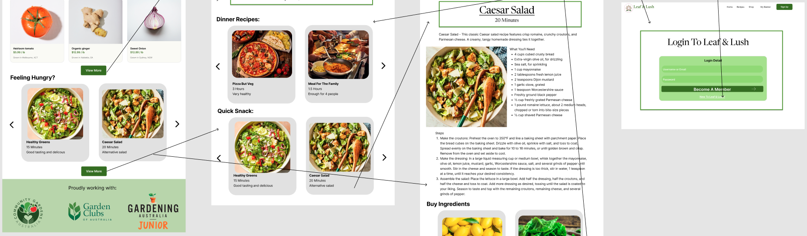
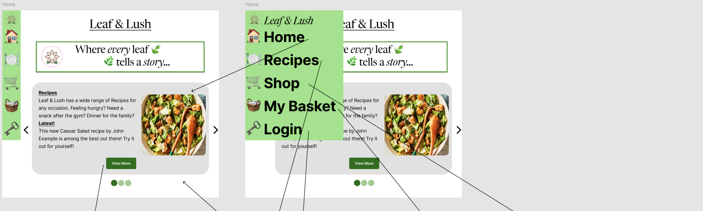
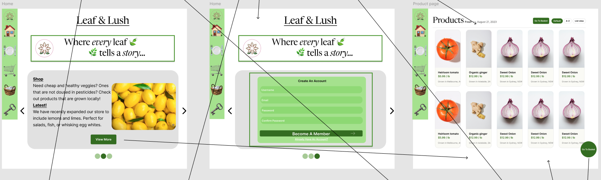
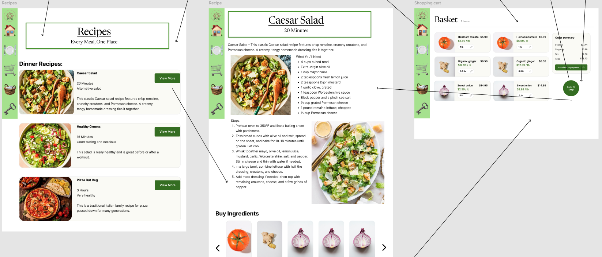
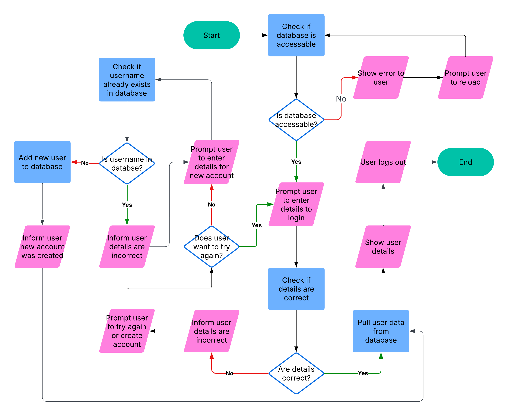
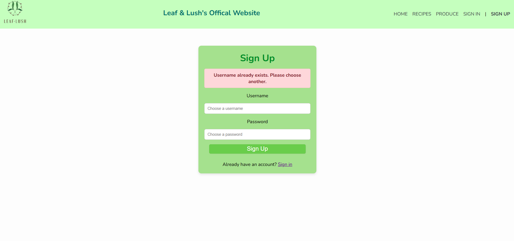
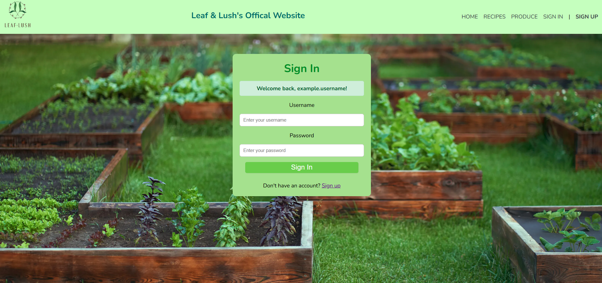

# Web Development Task - Leaf & Lush
Leaf & Lush will be an online store focused on selling homegrown vegetables and sharing fresh, garden-to-table recipes. The platform will connect local growers to customers and inspire healthy cooking.
## Functional & Non-Functional Requirements
### Functional Requirements
- Users can view recipes and products.
- Users can add items to their cart.
- Users can use a checkout to pay for the goods.
- Recipes link to ingredients available in-store.
- Users can login as well as add and remove credit card information.
- Users can add listings and sell produce.
- Database and front-end must be able to communcate.
### Non-Functional Requirements
- A green theme that is pleasant to the eye.
- A well designed layout that is easy to navigate.
- Smooth transitions between pages.
- Users can view order history.
- Should not take excessive time to load.
- Users can rate recipes and goods. 
## Scope
Due to time constraints the scope of the project will be limited three simple but core parts browsing what the website has to offer, logging in, be able to buy produce. Additionally, if time permits also a way for users to add listing and sell produce.
## UI Design Wireframe
| Choices | Description |
| ----------- | ----------- |
| Colour Palette | The colour theme I chose was white, pastel green and other variations. The white gives a clean and semi-professional look. While on the other hand, the pastel green also gives gives the website welcoming look. The various shades of green can be used to highlight certain aspects of the UI such as button, textboxes, etc. |
| Typography | I chose a combination of the fonts Newsreader and Inter. They are both clear and professional fonts perfect for my goal of trying to create a casual professional website. |
| Images | The images I chose for the recipes and products are all eye-catching, straight to the point, and appealing. These images will allow the user to see recipes and products before they make or buy them. |
### Images Of Wireframe



You can view the wireframe in better detail [here](https://www.figma.com/design/GM4gpWhBxVio2TyjBGHUlF/Leaf---Lush---2025-Computer-Technology-Assessment-3---Yi-Ping?node-id=1669-162202&t=JQH6FRsWkqxtmnar-1).
## Alternate Wireframe Design
| Choices | Description |
| ----------- | ----------- |
| Colour Palette | The colour theme I chose was white, pastel green and other variations. The white gives a clean and semi-professional look. While on the other hand, the pastel green also gives gives the website welcoming look. The various shades of green can be used to highlight certain aspects of the UI such as button, textboxes, etc. |
| Typography | I chose a combination of the fonts Newsreader and Inter. They are both clear and professional fonts perfect for my goal of trying to create a casual professional website. I also decreased the amount of writing to make the descriptions and recipes less tedious to read. |
| Images | The images I chose for the recipes and products are all eye-catching, straight to the point, and appealing. These images will allow the user to see recipes and products before they make or buy them. I also increased the amount of images to make the website more visually appealing. |
### Feedback Incorporated
Following my client's feedback I reduced the amount of text on the pages by making the descriptions shorter and the instructions more concise. The recipes also have more images to break up the text more. Additionally, I resized the product displays, which were previously unnecessarily large. Furthermore, I reduced the scrolling required on all pages, as per the client's request, especially on the homepage and increased image sizes for better user engagement. 
### Images Of Alternate Wireframe




You can view the wireframe in better detail [here](https://www.figma.com/design/GM4gpWhBxVio2TyjBGHUlF/Leaf---Lush---2025-Computer-Technology-Assessment-3---Yi-Ping?node-id=1669-162202&t=JQH6FRsWkqxtmnar-1).
## Flowchart
Flowchart of the login page and the account creation. 

### Test Case 1
**Test Case ID:** 001

**Test Case Name:** Logging In

**Prediction:** User will sucessfully login, see their account info, and log out.
### Steps
1. Code checks if database is accessable. Code will reload until the database is accessable.
2. Prompt the user to enter login details.
3. User will enter details.
4. The code will check if the details match the database.
5. The details will be correct and the code will pull the user's data from the database.
6. The code will display the information.
7. The user will log out and the code will end.

### Test Case 2
**Test Case ID:** 002

**Test Case Name:** Failing To Login And Creating Account

**Prediction:** User will fail to log in, create an account, and there will be a new account in the database.
### Steps
1. Code checks if database is accessable. Code will reload until the database is accessable.
2. Prompt the user to enter login details.
3. User will enter details.
4. The code will check if the details match the database.
5. The details will be incorrect and the code will prompt the user to try again or create an account.
6. Code will prompt user to enter details for a new account. 
7. The code will check if the username is taken. If it is then the code will prompt the user to try again.
8. If all the info are valid then the new account will be created.
9. The code will then pull the account info from the database.
10. The code will display the information.
11. The user will log out and the code will end.
## Progress Log - Week 5 - SQL & Databases
- I already had most of the nesscary resources (such as VSCode, Python, SQLite3, Git-Bash, VSCode Extentions, etc.). I only had to install Flask, however, this proved easier said then done, when I tried to excute `pip install flask` in Bash to install Flask I recieved `Error: Command not found`. I by passed this problem by excuting Powershell, which I was more familiar with. I excuted `py -m pip install flask` which worked. I also helped some of my peers who were stuggling to install Flask.
- I followed the provided guide to set up my database. I used the Github template, which allowed me to skip some of the steps. Addtionally, some steps of the guide used commands to create files and folder, but this was prone to error so instead I read the commands and manually created the folder. This way I was also able to better keep track of my file tree. 
- Once I had the example database working I familiarised my self with the editor, format, and syntax. I was quickly able to create my own table and queries. I created two tables and linked them together using a single common key which was `userID` and using SQLite3 queries I was able to conditionally retrieve data from both `userData` and `orderData` tables together. 

Here is some of the code I wrote that is responsible for clearing and then creating tables:
```
DROP TABLE userData;
CREATE TABLE
    userData (
        userID INTEGER NOT NULL PRIMARY KEY,
        email TEXT NOT NULL,
        password TEXT NOT NULL,
        age INTEGER NOT NULL,
        friendIDs TEXT NOT NULL,
        language TEXT NOT NULL
    );
```

Here is some of the code I wrote that is responsible for populating tables:
```
INSERT INTO
    userData (userID, email, password, age, friendIDs, language)
VALUES
    (
        1,
        "email@email.com",
        "password",
        20,
        "2,3",
        "Python"
    );
```

Here is one of the queries I wrote that is responsible for retrieving data from the tables (it finds the email and age of all users who ordered item 1):
```
SELECT
    email,
    age
FROM
    userData
WHERE
    userID = (
        SELECT
            userID
        FROM
            orderData
        WHERE
            itemID = 1
    )
```
## Progress Log - Week 6, 7 & 8 - HTML & CSS
- I started the website development by following the guide. Unfortunately, the images on my website would not load. I sought some help from my peers and I was tought a trick, by control clicking a link it will attempt to load the link and you could then easily check if the the link worked. Using this trick and some resources online I was able to fix the image issues. 
- I also had an issue with my files communicating with eachother. I spent an entire lesson on the issue, however, I was unable to solve it. I deuced that it was likely cause by file name changes so I revered all of my file names to the ones written on the guide and this solved the issue.
- After getting the homepage template working and linking the other webpages, I, instead of rushing ahead, slowed down and analysed the code and its interactions. This way I was able to quickly set new webpages, use features of the template effectively, use `for loops` instead of hard coding and change aspects the webpage.
- I first customised the homepage taking using the provided template to its fullest potential. I changed the theme of the webpage to a light green and added the Leaf & Lush logo. I created a second database file that the webpage could read from. This second database, while superficially seems the same has harding coding the homepage, it acts a proof of concept allowing me to create features, such as user posts and login pages, that would require the website to read and write an external database.
- Next I moved onto the sign up and log in page. I knew that this would be hard so I consulted some online guides and suprised the process went smoothly. 

This snippet of HTML code that I wrote is responsible for collecting the user's data (i.e. the front end) on the sign in page:
```
<form action="{{ url_for('signin') }}" method="POST" class="signin-form">
        <label for="username">Username</label>
        <input type="text" id="username" name="username" placeholder="Enter your username" required>

        <label for="password">Password</label>
        <input type="password" id="password" name="password" placeholder="Enter your password" required>

        <button type="submit" class="btn">Sign In</button>
</form>
```

This snippet of Python (using Flask library) that I wrote is responsible for verifying the validity user's data (i.e. the back end):
```
@app.route("/signin", methods=["GET", "POST"])
def signin():
    if request.method == "POST":
        username = request.form["username"].strip()
        password = request.form["password"].strip()

        conn = get_db_connection()
        user = conn.execute(
            "SELECT * FROM userData WHERE username = ? AND password = ?",
            (username, password),
        ).fetchone()
        conn.close()

        if user:
            flash(f"Welcome back, {username}!", "success")
            return redirect(url_for("index"))
        else:
            flash("Invalid username or password", "error")
            return redirect(url_for("signin"))

    return render_template("signin.html")
```
- After I had the sign up and log in page working I wanted to make them aesthetically pleasing, I used diffrent shades of green for diffrent objects on the webpage. Addtionally, I added coloured flash text that informs the user of incorrect passwords, usernames already exisiting, etc. I also modified the, typography, size, colour, aligment, hyperlinks, corner curvature, etc. of the sign up and log in boxes to allow it to better fit the theme of my website. 

Here is an example of the sign in page's flash text informing the user that the username is already in use:

- My next step was adding background images to the sign up and sign in page. Ironically this simple task proved quite difficult, the image displayed but there was large margins on eachside. After studying some online tutorials and using some trial and error I was able to finally properlly align and display the background image correctly.

This snippet of HTML code that I wrote is responsible for modifying the path, size, position, alignment, margin, etc. of the background image:
```
<style>
    html,
    body {
        height: 100%;
        margin: 0;
    }

    body {
        background-image: url("{{ url_for('static', filename='assets/backdrop5.webp') }}");
        background-size: cover;
        background-position: center;
        background-repeat: no-repeat;
    }
</style>
```

Here is an image of the sign in page's background displaying correctly and the flash text welcoming the user after a successful log in:

- Afterwards, as recommended by my client, I set my sights on the recipes and produce page. There were some small issue along the way but eventually I was able to format the pages as I had planned.
- One of my favourite features of the produce and recipe pages' wireframe was its scrollable card design where one would buy the produce required for the recipe at the bottom of the page and vice versa. After some planning I chose a carousel design to show the purchasble ingredients. However, even with online guides to help me it was still diffcult, I ran into multiple problems. My first version of the code rendered perfectly but was unresponsive when I attempted to turn the carousel. 
- I spent an hour trobleshooting with no progress so I changed my approch, I rewrote the design using my own ideas instead of following the guide and I was able to make the carousel turn when the arrow buttons were clicked. Unfortunately, the images rendered incorrectly, furthermore, my second design did not allow of the acutal recipe to be rendered because due to an unknown reason nothing would display when I inserted the code that rendered the recipe.
- Following some thought and discussion with peers, I tried to bridge the two peices of code together, as after all one peice of code was displaying correctly and the other was interactive. I quickly made progress, fitting the images into the carousel cards, alothought some styling was still needed. However, I was unable to find a solution to the recipe not being able to render.